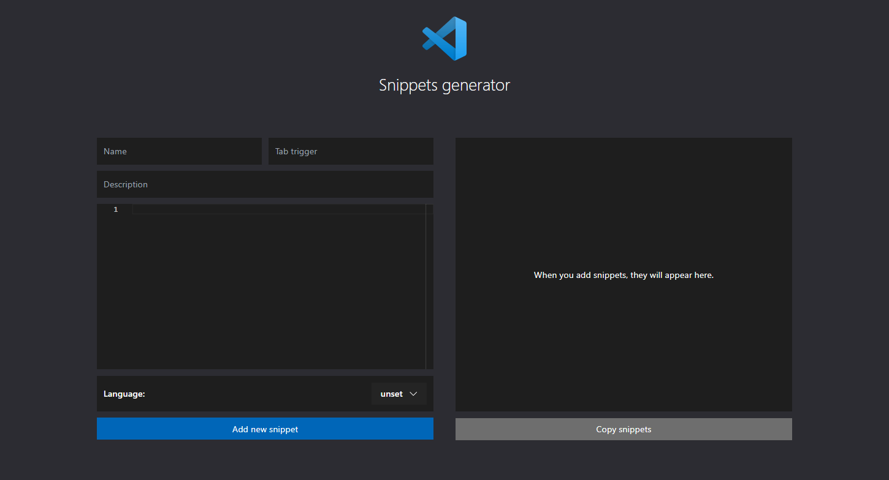

 
# VSCode snippets generator

On the left choose language, then enter snippet name, tab trigger, description, and snippet itself. Then click add a new snippet.

After you're done you can copy snippets to your snippet file.

## License

MIT
